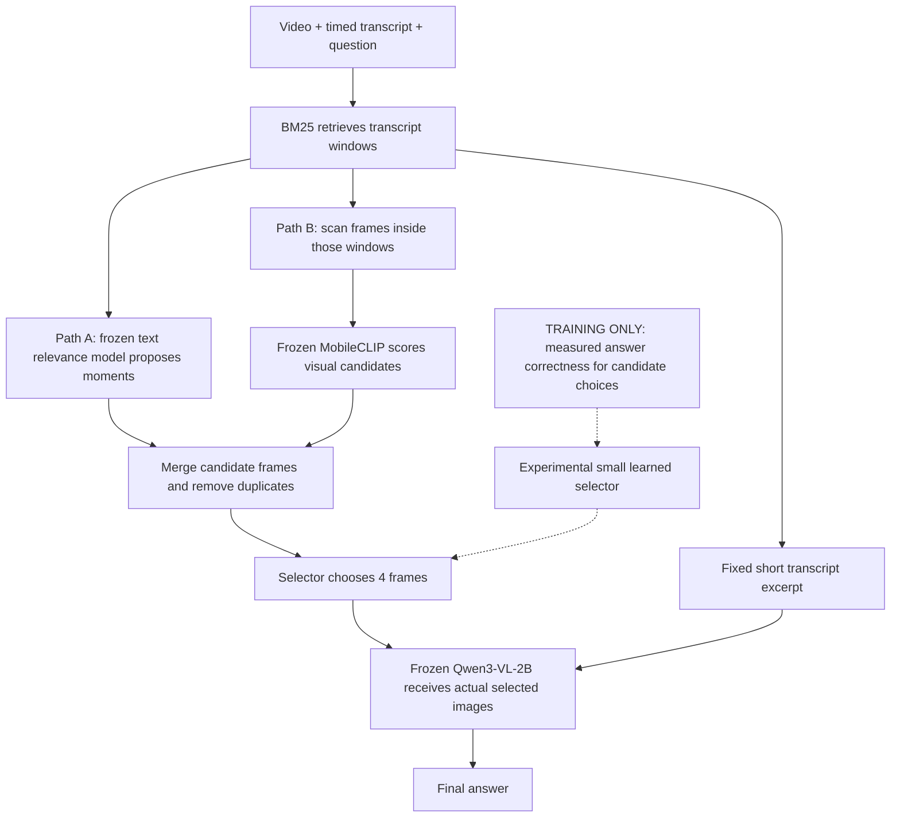

# Framework 2 final evidence review

Completed 5 October 2026. Code reviewed: `D:\local-surf`, branch `framework-2`, commit `8b55ea3`, including the nine commits after `b0381a9`.

## 1. The honest conclusion

**The video-QA framework works. The additional learned frame selectors have not demonstrated an advantage. Publication is not ruled out, but the current evidence does not support a new superior-selector paper.**

There are real positive results: on the original LongVideoBench experiment, selected frames improved accuracy from 32.5% to 41.6%. On the MIT questions, that benefit survives averaging over answer-option rotations. The failures concern the proposed improvements over simple selection rules, the validity of some synthetic-data conclusions, and generalization of a particular scan improvement.

My earlier recommendations gave too much weight to plausible mechanisms before establishing that they were real bottlenecks. The later tests do not justify continuing to enlarge the selector. They also do not justify saying that every possible approach was tested or that publication is impossible.

**One final experiment is defensible:** test whether answer-option position has distorted the action-quality labels used to train frame selection. Keep the architecture unchanged, first measure label stability under balanced option rotations, and train the existing small head only if useful signal survives. This is a measurement repair and a research hypothesis, not a promised novel algorithm.

This audit used source review, saved predictions and CPU recomputation. All **205 tests passed in 21.96 seconds**. No new GPU inference, downloads, or repository source edits were performed. It does not claim formal verification of every line or an exhaustive search of all papers worldwide.

## 2. What the framework currently does

The selector chooses evidence; Qwen generates the answer. There is no requirement that the transcript contain an error. Normal questions can need visuals because speech omits a diagram, equation, action or detail.

| Component | Actual role | Trained here? |
|---|---|---|
| BM25 and transcript packing | Find candidate windows and retain short speech context | No |
| `cross-encoder/ms-marco-MiniLM-L6-v2` | Question–speech relevance features for Path A | Frozen |
| Head A | Small linear predictor of text/frame utility | Experimentally trained; did not establish an improvement |
| MobileCLIP-S2 | Global image/text embeddings and similarity | Frozen |
| RapidOCR | Extract visible text features | Frozen |
| Head B | Small MLP over image/text and scalar context features | Experimentally trained; did not establish an improvement |
| Completion head | Residual ridge scorer choosing a fourth frame after fixed top three | Experimentally trained; did not beat relevance |
| Latest local extension | Eight local-feature summaries added to the completion scorer | Small scorer trained; encoders frozen |
| `Qwen/Qwen3-VL-2B-Instruct` | Final answer and action-label generation | Frozen |
| Qwen3-VL-4B used in question generation | Write/check synthetic MIT questions | Used for inference, not trained in these experiments |

Both paths currently depend on the same BM25 windows. Path B is a visual scan, but not an independent whole-video rescue path. The main pool proposals use pretrained Head A relevance; the trained Head A is evaluated as a reranker. The usual `videoqa ask` entry point still follows the earlier pipeline; successful v2 selector deployment would require explicit integration.

## 3. Results across the actual datasets

These are different experiments, not a single leaderboard. Counts and protocols matter. The audit independently recomputed the principal accuracies from saved per-question predictions.

| Experiment | Data and protocol | Transcript only | MobileCLIP | MMR | Relevance | Learned result |
|---|---|---:|---:|---:|---:|---|
| LongVideoBench v1 | 440 questions, 252 videos; up to 8 frames, CLIP mean 5.99 | 32.50% | 41.59% | Not run | Different transcript-retrieval rule: 36.36% | Heuristic controller, not learned: 37.50% |
| MIT pilot | 132 synthetic questions, 5 lectures; 4 frames; original option order | 44.70% | 56.06% | 54.55% | Not run | Best reported learned seed mean: 57.58% |
| MIT main | 197 synthetic questions, 20 lectures; 4 frames; original order | 15.23% | 34.52% | 36.04% | 38.58% | Head B OCR mean: 34.69%; Head A frame credit: 30.46% |
| MIT main, rotation average | Same 197 questions; legacy scan; average over 4 cyclic option orders | 34.26% | 49.75% | 51.52% | 52.16% | **Not re-evaluated** |
| MIT main, rotation average | Same 197 questions; balanced scan | Same 34.26% reference | 53.30% | Not re-evaluated | 52.41% | **Not re-evaluated** |
| LongVideoBench v2 | **Same 440 questions/252 videos as v1**; 4 frames; legacy scan | **Not run** | 42.95% | 43.18% | 40.68% | **Not transferred** |
| LongVideoBench v2 | Same 440 questions; 4 frames; balanced scan | **Not run** | 42.50% | 42.27% | 40.45% | **Not transferred** |

Sources: [v1 predictions](D:/local-surf/reports/benchmark_v1/records.jsonl), [pilot](D:/local-surf/reports/v2_pilot/eval_rows.jsonl), [main](D:/local-surf/reports/v2_main/eval_rows.jsonl), [rotation average](D:/local-surf/reports/v2_circular/summary_v2_main.json), [balanced rotation average](D:/local-surf/reports/v2_circular/summary_v2_balanced.json), [LongVideoBench v2](D:/local-surf/reports/v2_lvb_transfer/summary.json).

### What is positively established?

| Paired comparison | Difference | 95% interval, clustered by video/lecture |
|---|---:|---:|
| LongVideoBench v1: CLIP frames versus transcript only | **+9.09 percentage points** | +4.60 to +13.62 |
| MIT rotation average: legacy CLIP versus transcript only | **+15.48 points** | +11.38 to +19.64 |
| MIT rotation average: balanced versus legacy CLIP | **+3.55 points** | +0.45 to +6.93 |
| MIT rotation average: relevance versus CLIP | +2.41 points | −0.52 to +5.48 |
| LongVideoBench v2: balanced versus legacy CLIP | −0.45 points | −3.23 to +2.34 |

The first two comparisons show that visual evidence helps. Balanced scanning helps on the repeatedly studied MIT development set under the rotation-average protocol, but its advantage was not demonstrated on LongVideoBench. An interval including zero means no established improvement; it does not prove the true effect is exactly zero.

V1 uniform sampling achieved **39.32%**, versus CLIP's 41.59%. That +2.27-point difference has interval −1.16 to +5.95, so even the more elaborate untrained selector did not clearly beat cheap uniform sampling there. See [v1 comparison](D:/local-surf/reports/benchmark_v1/results.json).

Do not call 43.0% versus 41.6% a controlled v2 gain: frame budgets, pool building and other pipeline details differ. Do not subtract v1's 32.5% text score from v2's 43.0% and call it the effect of v2 frames; v2 needs its own matched text-only arm. The lower main-MIT scores versus pilot also do not demonstrate model regression, because question selection changed.

### Which configuration currently works best?

There is no demonstrated universal winner. On the existing LVB subset, legacy-scan MMR has the highest observed v2 score, **43.18%**, narrowly ahead of CLIP's **42.95%**; that does not establish MMR's superiority. On MIT rotation-average evaluation, balanced CLIP reaches **53.30%**. Keep these as dataset-specific observations. The trained heads should remain experimental rather than become the default.

## 4. The MIT dataset problem, explained simply

The generator favored putting correct answers early in the option list. Then the filter removed questions that the 2B model could answer without evidence. Because model guesses were not neutral across answer positions, this filtering increased the imbalance.

Before that filter, gold positions among 349 questions were:

| | A | B | C | D | A or B |
|---|---:|---:|---:|---:|---:|
| Before filtering | 133 | 149 | 60 | 7 | 80.80% |
| After filtering, 197 questions | 79 | 92 | 24 | 2 | **86.80%** |

The filter removed **39.36% of A/B-answer questions**, versus **61.19% of C/D-answer questions**. The measured imbalance increased. The proposed letter-preference mechanism is plausible and consistent with prediction counts; separating it from content difficulty requires randomized position controls before filtering. Do not claim that the observational counts alone isolate every causal factor. Source: [option-position audit](D:/local-surf/reports/v2_review/option_position_bias.json).

“Always answer B” scores **46.70%** on the main set. The pilot also has a problem: “always B” scores **59.09%**, above its best reported learned mean of 57.58%. This does not mean the VLM understands nothing. It means original-order absolute accuracy on these particular sets is a poor standalone measure of video understanding.

### Rotating options helped measurement, but did not repair everything

The same question was evaluated four times, with the choices cyclically shifted. This gives each answer each position once. It produced **788 question-order evaluations, but still only 197 questions from 20 lectures**.

Two metrics must remain separate:

- **Rotation-average accuracy:** average correctness across the four orders. Balanced CLIP scores 420/788 = **53.30%**.
- **Strict all-four correctness:** the question counts as correct only if every rotation is correct. Balanced CLIP scores 51/197 = **25.89%**.

The latter matches the strict idea behind [MMBench CircularEval](https://github.com/open-compass/MMBench). Neither metric should be presented as the other. Four cyclic orders also do not cover all 24 possible permutations of four choices.

Most importantly, the new script rotates only the transcript-only and simple-selector evaluations. It does **not** restore discarded questions, verify synthetic answers, rebuild learned training labels, retrain the heads, or rebuild the exhaustive fourth-frame oracle. Therefore the accurate statement is **“we diagnosed the dataset bias and partially corrected evaluation,” not “the MIT dataset and all experiments are corrected.”** The synthetic provenance should also be fixed: current MIT rows contain `is_synthetic:false` despite their documented synthetic origin.

## 5. What each proposed improvement actually tested

| Direction | Result | What the result supports |
|---|---|---|
| Original Head A frame utility | Worse than relevance | These features/labels and this training setup did not improve selection |
| Original Head B | Approximately simple CLIP performance | No established value from this trained head on this assay |
| Deployment-matched fourth-frame labels | 74/197 versus relevance 76/197 | Changing from single-frame to fixed-prefix labels was insufficient |
| Local feature extension | 75/197 = 38.07%; relevance 38.58%; fallback 19/20 folds | Eight local scalar summaries plus ridge did not improve the result |
| Stable-run dedup audit | Four threshold-detected edits in 4,728 frames; the inspected lost-ink case was a reflection | No convincing answer-relevant loss found by this audit; not proof that all deduplication is harmless |
| Padding / tiles | Padding worsened the tested ranking; tiles showed no reliable gain | No supported gain in the fixed-pool reranking ablation |
| Balanced scan on LVB | −0.45 points, interval spans zero | MIT scan advantage did not reproduce convincingly on this subset |

The local experiment did **not** implement a trainable spatial-attention model reading board regions. It appended eight hand-designed tile/ink summaries to 26 global features, using the existing ridge scorer. That is a reasonable cheap test. Its failure does not disprove every spatial method, but it also gives no evidence for spending more on a larger one. Its extra median feature costs were approximately 0.575 seconds for tile encoding and 0.077 seconds for ink maps. See [local report](D:/local-surf/reports/v2_completion_local/summary.json) and [implementation](D:/local-surf/src/videoqa/v2/local_features.py).

The crop experiment reranked pools originally built using the cropped scout. It did not rebuild every upstream proposal, so its outcome is not an upper or lower bound on end-to-end padding. The dedup audit covered stable-run collapse, not all merge-stage deletions. These scope limits matter; they do not establish that either idea would work if tested more extensively. Sources: [crop ablation](D:/local-surf/reports/v2_scout_crop/summary.json), [dedup audit](D:/local-surf/reports/v2_evidence_loss/dedup_summary.json).

“Nothing transferred” is also too broad. The new LVB run transferred simple CLIP/MMR/relevance policies and scan settings. It did not transfer trained heads. Its question IDs are exactly the old 440 IDs, so this is a useful cross-dataset stress test, not an untouched final benchmark.

## 6. What the fourth-frame oracle really means

With relevance's first three frames held fixed, the table evaluates every remaining candidate as the fourth frame. It contains 1,500 candidate rows on 197 questions:

- Relevance fourth frame: **76 correct**.
- Learned completion head: **74 correct**.
- Best possible fourth choice with access to outcomes: **89 correct**.
- Questions whose correctness changes across fourth choices: **36**.
- Three-frame anchor correct: 66; for 13 of these, at least one fourth choice harms it.

The 13-question difference between 89 and 76 is **+6.60 percentage points**, interval +3.55 to +9.88. This is a real measurement of the **original-order table**. It is conditional on one fixed prefix, candidate pool, answerer and option order. It is not a full four-frame oracle or a guaranteed learnable improvement.

Because the labels were not rotation-controlled, part of that apparent utility could be sensitive to answer-option position. How much is unknown. The corrected remaining headroom must be measured before promising that a trained selector can capture 6.6 points. Source: [completion results](D:/local-surf/reports/v2_completion/summary.json).

## 7. Why did the methods fail?

The evidence supports several limitations, not one proven universal cause.

**Weak and potentially unstable supervision.** Only 36 original-order questions distinguish fourth-frame outcomes. The answerer is position-sensitive, while selector rewards were computed in one ordering. These facts make training difficult; the fraction of action preferences that actually reverse under rotation has not yet been measured.

**Synthetic selection bias.** The corpus is small, skewed by generator behavior and answerer-dependent filtering, and repeatedly used for development. Rotation rescoring cannot restore the population excluded by the filter. The earlier filter also rejected cases where both unimodal checks fail before establishing whether joint evidence succeeds.

**Restricted action space.** A fourth-slot head cannot replace the first three frames or recover frames missing from the candidate pool. A strong semantic selector is not guaranteed to exist over the stored aggregate features. An oracle sees answer outcomes; a real head does not.

**Representation changes may not target the real bottleneck.** The crop and dedup concerns were plausible, but later checks did not establish them as dominant causes. Adding local scalar features adds expense and variance without necessarily representing the answer-relevant distinction.

**Task/domain differences.** Lecture boards often persist across time, whereas general videos can depend on motion and dispersed events. This is a plausible explanation for scan/relevance differences across datasets, not a separately proven causal result. A rule that helps one development set can fail elsewhere.

**Repeated development limits certainty.** Leave-one-lecture-out prevents direct fold leakage, but repeatedly changing methods after viewing the same aggregate results still makes that set development data. A hypothesis recorded in Git is useful chronology, not an independent preregistration or an untouched test.

## 8. Code repairs and spending audit

The new request cache identity, stricter label joins and manifest-wide split checks are useful repairs. Tests pass. The historical cache audit checks **10,609 main/pilot records** and specific collision scenarios. It does not reconstruct all historical rendered requests/configurations or include every cache; the balanced cache is outside the location inspected by that script. Therefore “could not have changed any past result” is stronger than the audit demonstrates. **No actual historical result corruption was identified.** See [cache audit](D:/local-surf/reports/v2_review/cache_identity_audit.json) and [teacher implementation](D:/local-surf/src/videoqa/v2/teacher.py).

Pool-control checking raises on major question/transcript mismatches but counts Path-A differences rather than rejecting them. Actual reported comparisons matched, so no resulting confound was established. Tightening future checks is appropriate without invalidating old numbers by assumption.

Fresh answerer calls are independently confirmed:

| Work | Fresh calls |
|---|---:|
| Circular evaluation | 3,495 |
| LongVideoBench comparison | 2,375 |
| Crop comparison | 563 |
| **Total** | **6,433** |

Against the 3,000-call cap stated in your account, that is 3,433 excess calls. A higher time cap does not automatically raise a call cap. Recorded time inside answer calls totals **3.021 hours**; pool building and feature computation add work. The reported 4.5 total GPU-hours was not independently reconstructed from one complete ledger, so it remains a reported total, not a number verified by this audit.

Future runners should enforce both limits, reserve the cost of a complete question block before starting it, persist consumption, and stop at whichever limit comes first. These are execution controls, not research novelty.

## 9. One final improvement: order-robust action supervision

**Do not add a new model. Change how the existing selector's training target is measured.**

In plain language: currently a frame gets a “good” or “bad” label from one answer ordering. Ask the same frozen answerer under balanced orderings, with identical evidence. A frame should receive credit for consistently useful evidence, rather than a lucky placement of the correct option. This may expose cleaner learning signal—or show that the apparent opportunity disappears. Neither outcome is known yet.

For fixed question `q`, transcript `T`, selected prefix `S`, and candidate `c`, define:

`utility(c) = average over rotations [correct(q,T,S+c) − correct(q,T,S)]`.

Use the **same rotations** before and after and across candidates. Permutations are defined independently of which option is correct. Remap gold only for scoring; do not reveal it to the selector. Keep selector inputs and the selected frame choice independent of the answerer's rotation. For the fixed-prefix task, ranking by average correctness after addition is equivalent because the before term is shared.

The robust conditional oracle must be:

`max over candidates [average over rotations correctness]`.

It must **not** average a separately chosen oracle winner for each rotation; that would allow the oracle to change its selected frame with the answer ordering and overstate the opportunity for one fixed choice.

### A bounded diagnostic before training

1. Choose a small fixed, lecture-stratified development sample using a hash, independently of past correctness. Current MIT data can diagnose the old experiment, but remain biased development data.
2. Enumerate every candidate, anchor and rotation request, accounting for identity-valid cache reuse. Show the exact missing-call total before running.
3. Propose explicit dual limits, for example **500 fresh calls and one GPU-hour**, whichever is reached first. These are proposed limits, not authorization to run them in this review. If necessary reduce the sample before running, not based on observed outcomes. Preserve complete question tables.
4. Measure action-preference changes, utility sign stability, informative-question count, and robust conditional oracle gap. A small pilot with a wide interval may be inconclusive; do not call that proof no effect exists.
5. Only if a useful opportunity survives, propose a separate bounded training phase using the **same existing head, features, retrieval, answerer and four-frame budget**. Version the label schema because rotation means can be fractional, unlike the current binary before/after checks.

Rotation averaging does not create four independent questions and does not correct the filter's membership bias. Later training needs quality-verified pre-filter questions or an independent training source. Final evaluation needs untouched human questions from unused videos/courses, not the same 440 LVB examples. Count accessible eligible videos before promising a test size.

Compare against the old single-order training, the locked simple baseline, and an answer-stage position remedy as an attribution control. If calibration alone explains a gain, call it an answerer improvement. [PriDe](https://arxiv.org/html/2309.03882) is established prior calibration work; exact reproduction needs option probabilities, which the current caches do not preserve. A four-pass answer ensemble also costs four answers and is not equal-cost to one-pass deployment.

This recommendation is a supervised-label correction first. GRPO, DPO, larger vision encoders or final-VLM LoRA are not justified by the present evidence. Keep them out of this final experiment. Stop if useful signal disappears, if the unchanged head cannot improve held-out development results, or if the locked external comparison fails its declared criterion. Report an inconclusive result honestly rather than changing the architecture again.

## 10. Can this still become a paper?

**Possibly, but acceptance and novelty cannot be promised.** A superior frame-selector claim is unsupported. Negative method results do not make publication impossible, and “workshop only” is not a conclusion the data can establish.

However, “filtering amplifies option bias” is not automatically a new discovery. [Gated Against One Model, Open to the Next](https://arxiv.org/html/2608.15428) directly discusses model-dependent filtering, preferred distractors, answer-position habits and transfer limitations. [PriDe](https://arxiv.org/html/2309.03882) and [option-order research](https://aclanthology.org/2024.findings-naacl.130/) also establish positional sensitivity. A literature comparison must address these close sources rather than cite letter bias generically and claim the filtering mechanism is unprecedented.

A more specific potential contribution would ask: **does answerer-filtered, single-order synthetic QA distort marginal visual-utility labels enough to change conclusions about trained video evidence selectors?** That is not established by the current experiments. A credible study would need controlled filtering/ordering comparisons, more than one independent answerer, human-authored evaluation, label-stability measurements, and released reproducible action tables. If an order-robust correction helps at unchanged deployment cost, that would strengthen the case; if it does not, the controlled measurement result would need enough breadth to stand on its own.

The existing exhaustive table, reusable pipeline and negative results are useful assets. Their contribution must be stated at the scope they support. No optimizer or new name can substitute for the missing evidence.

## 11. Data choices and practical next steps

- **MIT pilot/main:** retain as historical/development sets. Correct provenance metadata. Keep original and rotation-average results distinct. Do not relabel them “unbiased” merely after shuffling options.
- **LongVideoBench:** retain the existing 440 questions as known development/stress-test data. Use a predeclared unused-video subset of remaining validation only if sufficient eligible videos are accessible, and label it a custom held-out subset rather than the full official test. [Official dataset and protocol](https://github.com/longvideobench/LongVideoBench).
- **EduVidQA:** suitable lecture-domain expansion, but not a prerequisite for the small label-stability diagnostic. It is free-text QA, so it requires accessible videos and an audited scorer. The last local readiness audit reports 3,909 train, 1,056 synthetic-test and 269 real-test questions, no downloaded videos and transcripts for 87/296 videos. This review did not perform a new access/download audit. [Official EMNLP 2025 release](https://github.com/sourjyadip/eduvidqa-emnlp25).
- **NExT-GQA:** optional grounding transfer benchmark, not an already completed result. Raw-video access, split handling and the role of val/test grounding annotations must be checked first. [Official annotations](https://github.com/doc-doc/NExT-GQA/blob/main/datasets/nextgqa/README.md).

You do not need to manually label every frame. Automatic answerer comparisons can supply action labels. A stratified human audit checks question validity, gold answers, evidence and scoring errors. Its sample size and uncertainty should be reported; it is not a guarantee that every automatic label is correct.

## 12. Evidence and deliverables

The review notes preserve quantitative recomputation, code/data findings and primary-source comparisons under `research_notes/Framework 2 final evidence review/`. The companion `Claude final bounded experiment prompt.md` gives the implementation handoff without launching new compute.

The immediate decision is to keep the functioning simple pipeline, stop treating the failed heads as improvements, and test the validity of their supervision before considering any further training. That decision preserves your work while putting a firm limit on the next expenditure.
