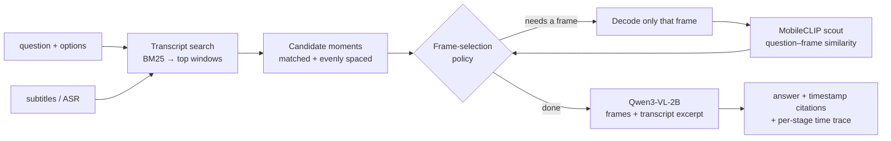

# Long-video QA on a single consumer GPU

[](https://github.com/ham0004/local-surf/actions/workflows/tests.yml)

A **fully local** question-answering framework for long videos (seconds to an hour). Showing a
whole video to a vision-language model is too slow and too expensive, so the framework
**decides which few frames to look at**. It searches the transcript for the relevant moments,
scores candidate frames with a cheap image model, decodes only the frames it needs, and asks a
small frozen VLM to answer from those frames plus a short transcript excerpt. Every answer comes
with timestamp citations and a per-stage time trace.

- **Models:** Qwen3-VL-2B-Instruct (answers) · MobileCLIP-S2 (frame scoring) · BM25 (transcript search)
- **Hardware:** one RTX 5060 Ti (16 GB) · about **1–2 s per question**
- **Status:** v1 working and benchmarked; v2 (this branch) adds a research study of *learned* evidence selection. Ongoing project.

## Results: LongVideoBench (440 questions, 252 videos)

Same model, same questions, at most 8 frames per question. Chance level: 21.4%.

| frame-selection strategy | accuracy | 95% CI | time / question |
|---|---|---|---|
| Transcript only (no frames) | 32.5% | 28.3–36.7% | 1.14 s |
| Transcript-retrieved moments | 36.4% | 31.7–40.8% | 1.11 s |
| Cost-aware heuristic | 37.5% | 32.9–42.0% | 1.47 s |
| Uniform frames | 39.3% | 34.7–44.0% | 1.26 s |
| **MobileCLIP top-k frames** | **41.6%** | 36.7–46.4% | 2.25 s |

- **Looking at frames helps.** MobileCLIP-selected frames are **+9.1 points** over transcript-only
  (95% CI +4.6 to +13.6), measured on the same questions.
- **Choosing frames by image content beats choosing them by subtitle match** (+5.2 points).
  Transcript search finds the right minute; an image scorer finds the right frame.
- **Accuracy vs time is explicit.** Uniform frames give most of the gain for +0.12 s. MobileCLIP
  is the most accurate at about +1 s, but its lead over uniform (+2.3 points) is not significant.
- **Placement:** the official leaderboard's 7–8B models score 40–50% with 8–16 frames, and GPT-4o
  66.7% with 256. This framework uses a 2B model and at most 8 frames. Those numbers are
  reference points, not a head-to-head (different protocol and question subset).

Full tables, paired comparisons, per-length results, scoring method and every prediction:
**[reports/benchmark_v1/RESULTS.md](reports/benchmark_v1/RESULTS.md)**.

## Version 2: learned evidence selection (research, this branch)

v2 keeps the v1 pipeline and asks whether small, cheap models can learn **which evidence actually
helps** a frozen answerer. Candidate windows feed two parallel paths: transcript **hot moments**
(Head A) and a **sparse visual scan** (MobileCLIP). The merged frames are scored by a small learned
**Head B**. Labels are measured answer changes from the frozen Qwen3-VL-2B.

Main experiment: 197 lecture questions, 20 MIT OCW lectures, each lecture evaluated by heads that
never saw it, with 4 frames per question.

- **Negative results, with controls:** no learned or feature-based selector (Head B, residual
  scorers, a head trained on deployment-matched fourth-frame labels, local board features) beat
  zero-shot transcript relevance. An exhaustive oracle shows +6.6 points of headroom in the last
  frame slot that none of them captures.
- **No transfer:** a balanced visual scan that helped on the lectures did not improve
  LongVideoBench (−0.5 points, 95% CI −3.2 to +2.3).
- **Dataset correction:** answerer-conditioned filtering left the lecture questions with the gold
  answer at A/B in 171/197 cases; circular (option-rotation) evaluation corrects all lecture
  accuracies upward by about 15 points.

**Full report (PDF):** [docs/report/framework_report.pdf](docs/report/framework_report.pdf):
design, dataset construction, labels, every comparison, corrections and limitations.

Details: [docs/v2/README.md](docs/v2/README.md) (design and modules) ·
[main_report.md](docs/v2/main_report.md) · [pilot_report.md](docs/v2/pilot_report.md) ·
[novelty_check.md](docs/v2/novelty_check.md) (prior work; no novelty claimed).

## How it works



Frames are decoded **lazily**, so each policy pays only for the work it does. The five
policies, the module map and the information-access rules are in
[docs/architecture.md](docs/architecture.md).

## Quick start (CPU, no GPU and no downloads, about 1 minute)

Requires Python 3.12 and [uv](https://docs.astral.sh/uv/).

```bash
git clone -b framework-2 https://github.com/ham0004/local-surf.git
cd local-surf
uv sync --extra dev
uv run pytest -q                 # 166 tests

# A synthetic lecture video + transcript, then ask a question about it
uv run videoqa make-synthetic --out data/synthetic --n 2
uv run videoqa ask --video data/synthetic/videos/synth_0000.mp4 \
    --transcript data/synthetic/transcripts/synth_0000.json \
    --question "What final accuracy is shown on the results slide?" \
    --options "67%|77%|87%|97%" --config configs/cpu.yaml --out runs/ask/demo
```

This writes `runs/ask/demo/result.json` (answer, cited timestamps, cost trace) and
`contact_sheet.png` (the frames it chose). The CPU config uses a test-double answerer to check the
plumbing; real answers need the GPU setup below. Without uv: `pip install -e ".[dev]"`, then drop
the `uv run` prefix.

## Real models (NVIDIA GPU, ≥ 12 GB)

```bash
uv sync --extra dev --extra models          # torch (CUDA 12.8), transformers, open_clip
uv run videoqa ask --video your_video.mp4 --transcript your_subtitles.srt \
    --question "..." --options "A|B|C|D" --config configs/gpu_12gb.yaml --policy scout_similarity
```

On first run, Qwen3-VL-2B (~4 GB) and MobileCLIP-S2 download from Hugging Face into
`cache/`. Policies: `transcript_only`, `uniform`, `retrieval`, `scout_similarity`, `heuristic`.
`uv run videoqa profile …` prints a cold vs warm per-stage time breakdown.

## Reproduce the benchmark

LongVideoBench is gated: accept its terms on Hugging Face and log in first.

```bash
HF_TOKEN=... uv run python scripts/download_longvideobench_subset.py --out data/longvideobench_full
bash scripts/run_lvb_benchmark.sh                      # about 1.7 h on an RTX 5060 Ti
uv run python scripts/benchmark_report.py              # writes reports/benchmark_v1/
```

## What was tried, and what was learned

Version 1 also tested a research idea: **train a small controller** to spend visual effort only
when important speech is missing, using pairs of transcripts where answer-relevant speech was
damaged vs. an equal amount of unrelated speech. An MLP and a Qwen3-0.6B + LoRA controller were
built and trained. The idea **could not be tested**. On four benchmarks (LongVideoBench,
Video-MME, EduVidQA, TVQA), only 0–4% of questions break when a local piece of speech is removed.
The answers are either visual, or repeated elsewhere in the dialogue. A text-only controller also
cannot see what is on screen. The training code was removed from this branch. The full account
and all measurements are in
[docs/final_report_controller_study.md](docs/final_report_controller_study.md); research notes are
in [docs/history/](docs/history/).

## Limitations

- Modest absolute accuracy, most likely from the 2B model and ≤ 8 frames. Larger models and more
  frames have not been benchmarked yet.
- Not yet compared with the same model given the raw video (its own frame sampling, no pipeline).
- Multiple-choice only; open-ended answers need an LLM judge checked against human ratings (planned).
- The model's timestamp citations are recorded but not graded.

## Layout

```
src/videoqa/     one module per stage (docs/architecture.md)
configs/         hardware profiles (YAML with inheritance) + measured cost model
tests/           166 tests, incl. real-mp4 decoding and a local HTTP server
scripts/         benchmark, report, dataset download, cost profiling
scripts/research/  dataset screens and lecture-mining tools from the research phase
reports/         benchmark_v1/ (results) · costs/ (measured costs) · history/
docs/            architecture, final report of the controller study, history/
```

Licences: code in this repo is unlicensed for now. Qwen3-VL and MobileCLIP are Apache-2.0.
LongVideoBench is CC BY-NC-SA 4.0 (non-commercial) and is not redistributed here.
