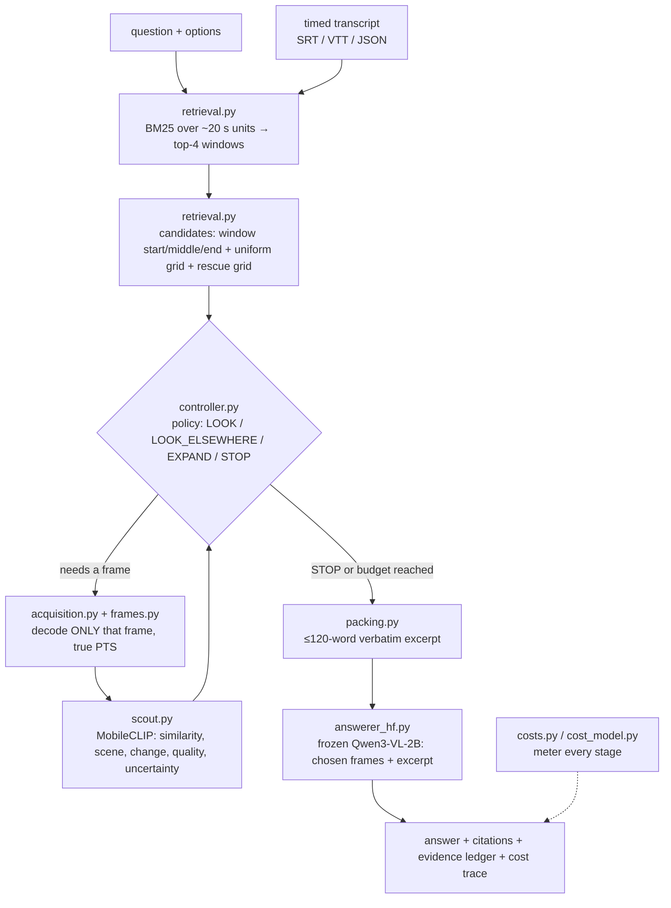

# How the code fits together (v1)

## The idea in one paragraph

A long video is too expensive to show a small vision-language model in full, so the framework
decides **which few frames to look at**. It searches the transcript, proposes candidate moments,
optionally scores them with a cheap image model (the **scout**), and a **policy** picks at most
8 frames. Only those frames are decoded. The chosen **real frames** plus a short **verbatim
transcript excerpt** go to a frozen **VLM** (Qwen3-VL-2B), which answers and cites timestamps.
Every stage is timed, so accuracy can be traded against measured seconds.

## Life of one question

Frames and scout scores are produced **lazily**: a policy pays only for the frames it actually
asks for. Transcript-only never decodes a frame; uniform and retrieval never run the scout.

## The five frame-selection policies

| Policy | Chooses frames by | Scout calls |
|---|---|---|
| `transcript_only` | none (text answer) | 0 |
| `uniform` | evenly spaced moments across the video | 0 |
| `retrieval` | start/middle/end of the best-matching transcript windows, best window first | 0 |
| `scout_similarity` | MobileCLIP question–frame similarity over all candidates, highest first | all candidates |
| `heuristic` | hand-set gain estimate minus measured time cost; stops when nothing pays | 4 seed frames |

Why `retrieval` trails `scout_similarity` (see `reports/benchmark_v1/RESULTS.md`): BM25 usually
finds the right ~60 s window, but samples only its start, middle and end, so the chosen frame
can be tens of seconds from the moment the question refers to. The scout compares the frame
*images* with the question and can pick the exact frame.

## Who may see what (enforced by types and tests)

| Component | Sees | Never sees |
|---|---|---|
| Scout | candidate frames, the question | — ; it may **output** only `ScoutSignals` (5 numbers, no text) |
| Policy | question, options, observed transcript, candidate times, scout signals, budget | gold answer, pixels |
| Answerer | question, options, verbatim excerpt, selected real frames | gold answer |
| Scorer (`evaluate.py`) | the answer and the gold option | — |

Tests: `tests/test_schemas.py` (field sets), `tests/test_scout.py` (no answer text),
`tests/test_splits.py` (no video straddles splits), `tests/test_acquisition.py` (policies pay
only for their own decoding and scouting).

## Module map

| Module | Role | Key idea |
|---|---|---|
| `schemas.py` | typed records | information-access rules live in the types |
| `config.py` | YAML + inheritance | hardware profiles only list differences |
| `transcript.py` | parse SRT/VTT/JSON, units, gaps | units are built from raw timed segments |
| `retrieval.py` | BM25, windows, candidates | rescue grid only outside retrieved windows |
| `frames.py` | decode with true PTS | counts every decoded frame (decoding is the hidden cost) |
| `scout.py` | frozen cheap hints | pixel statistics (CPU tests) or MobileCLIP-S2 (GPU) |
| `features.py` | action features | question-term coverage, local speech coverage, scout signals |
| `controller.py` | the five policies | one decision rule: `net = gain − λ·cost`, STOP if nothing pays |
| `acquisition.py` | lazy, metered frame/scout access | the path used by `ask`, `profile` and `evaluate` |
| `cost_model.py` / `costs.py` | measured per-action costs, stage meter | numbers measured on an RTX 5060 Ti (`configs/cost_model_rtx5060ti.yaml`) |
| `packing.py` | excerpt | verbatim; protects numbers and negations |
| `answerer.py` / `answerer_hf.py` | frozen answerers | fixture double (tests only) / real VLM with exact token counts |
| `pipeline.py` | glue + export | hard caps, evidence ledger, contact sheet |
| `evaluate.py` | policies × questions | exact-match scoring, bootstrap CIs resampling videos |
| `damage.py` | transcript damage (robustness mode) | targeted vs severity-matched control damage |
| `splits.py`, `datasets.py` | leakage-safe data loading | split by video before any variant is made |
| `fixtures.py` | synthetic lectures | plumbing only — never research evidence |
| `cli.py` | `videoqa …` commands | `ask`, `evaluate`, `profile`, `make-synthetic` |

## Two evaluation modes

* **Benchmark mode** (`evaluate --clean-only`): every question once, on its original
  transcript. This produced `reports/benchmark_v1/`.
* **Robustness mode** (`evaluate` without `--clean-only`): each question under clean,
  targeted-damage, severity-matched control-damage and ASR-noise transcripts, to measure how
  much each policy relies on speech.

## History

Version 1 also contained learned controllers (an MLP and a Qwen3-0.6B + LoRA scorer) trained on
paired transcript-damage labels. They were removed because the available benchmarks gave them
no signal to learn from; the full account is in
[final_report_controller_study.md](final_report_controller_study.md), and research notes are in
[history/](history/).
