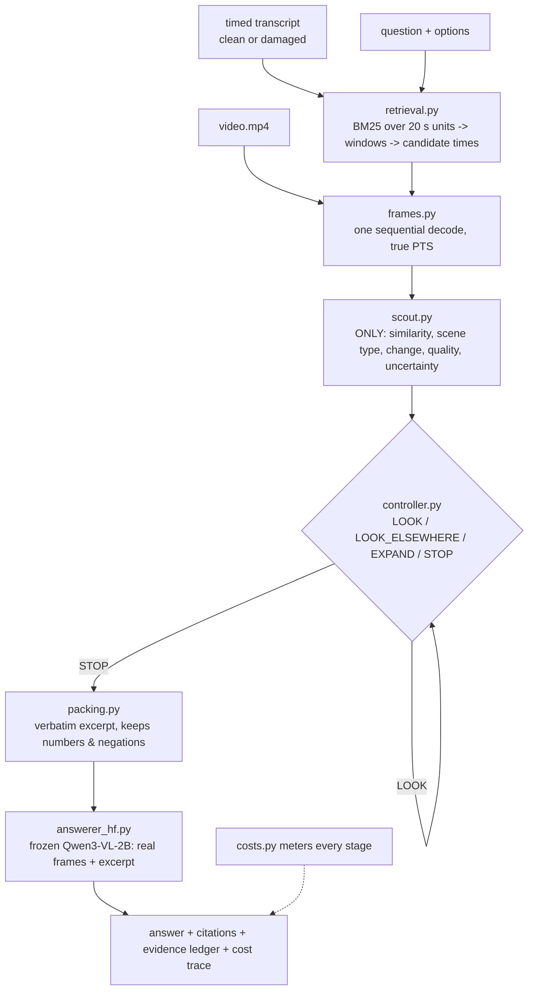

# How the code fits together

## The idea in one paragraph

A small **controller** ("brain") decides whether and where to look in a video. It reads the
question, the (possibly damaged) transcript, a list of candidate times, and cheap numeric hints
from a **visual scout**. It never sees pixels and never answers. The selected **real frames**
plus a short **verbatim transcript excerpt** go to a separate frozen **VLM**, which answers and
cites timestamps. The research question: if the controller is trained on the same question
under three transcripts (clean, answer-relevant speech damaged, equal unrelated speech
damaged), does it learn to look **because the missing speech mattered**, rather than because
any speech was missing?

## Life of one question

## Who may see what (enforced by types and tests)

| Component | Sees | Never sees |
|---|---|---|
| Scout | candidate frames, the question | — ; and it may **output** only `ScoutSignals` (5 fields, no text) |
| Controller | question, options, observed transcript, candidate times, scout signals, budget | gold answer, condition name, damage record, utility labels, pixels |
| Answerer | question, options, verbatim excerpt, selected real frames | gold answer |
| Label generator (train only) | everything, incl. gold answer — to **score** answers | test / dev videos (refuses non-train splits) |

Tests: `tests/test_schemas.py` (field sets), `tests/test_scout.py` (no answer text),
`tests/test_labels.py` (train-only guard), `tests/test_splits.py` (no video straddles splits).

## Module map

| Module | Role | Key idea |
|---|---|---|
| `schemas.py` | typed records | information-access rules live in the types |
| `config.py` | YAML + inheritance | hardware profiles only list differences |
| `transcript.py` | parse SRT/VTT/JSON, units, gaps | damage is applied to raw segments, units built after |
| `damage.py` | CLEAN / TARGETED / CONTROL triples | control matched in count, type, ~words; never answer-bearing; ≥ 10 s away |
| `retrieval.py` | BM25, windows, candidates | global-rescue grid only outside retrieved windows |
| `frames.py` | decode with true PTS | one pass; counts every decoded frame |
| `scout.py` | frozen cheap hints | pixel-stats (CPU) or MobileCLIP (GPU) |
| `features.py` | label-free action features | question-term coverage, local speech coverage, … |
| `heads.py` | NumPy utility MLP | absolute Huber + **paired** (targeted − control) Huber term |
| `controller.py` | policies | baselines, heuristic, learned (same decision rule) |
| `packing.py` | excerpt | verbatim; protects numbers/negations |
| `answerer.py` / `answerer_hf.py` | frozen answerers | fixture double (tests only) / real VLM with measured tokens |
| `pipeline.py` | glue + export | hard caps, no double charging, evidence ledger, contact sheet |
| `labels.py` | before/after utility labels | measured, never extrapolated; pairs step-0 rows |
| `train.py` | paired vs unpaired training | identical rows/optimiser; dev-tuned STOP |
| `evaluate.py` | policies × conditions | selectivity metric, cluster bootstrap by video |
| `splits.py`, `datasets.py` | leakage-safe data | split by video/course before variants |
| `fixtures.py` | synthetic lectures | plumbing only — never research evidence |
| `cli.py` | `videoqa …` commands | one command per stage |

## The paired loss in plain words

For a question whose answer was spoken at 16 s, compare a frame at 19 s under two transcripts:

* **targeted**: the 16 s line is deleted → the frame fixes the answer → measured gain 1.0
* **control**: an equally long, unrelated line at 74 s is deleted → the transcript still has
  the answer → measured gain 0.0

The ordinary loss teaches "gain(targeted) ≈ 1" and "gain(control) ≈ 0" separately. The paired
term additionally teaches "gain(targeted) − gain(control) ≈ 1" on these two rows, which differ
*only* in the transcript. Whether this extra coupling helps with limited data is the hypothesis
under test (`lambda_pair = 0` is the ablation).

## Hypothesis metrics

* `targeted_response = frames(targeted) − frames(clean)` → should be positive when looking helps
* `control_overspend = frames(control) − frames(clean)` → should be about zero
* `selectivity = targeted_response − control_overspend`
